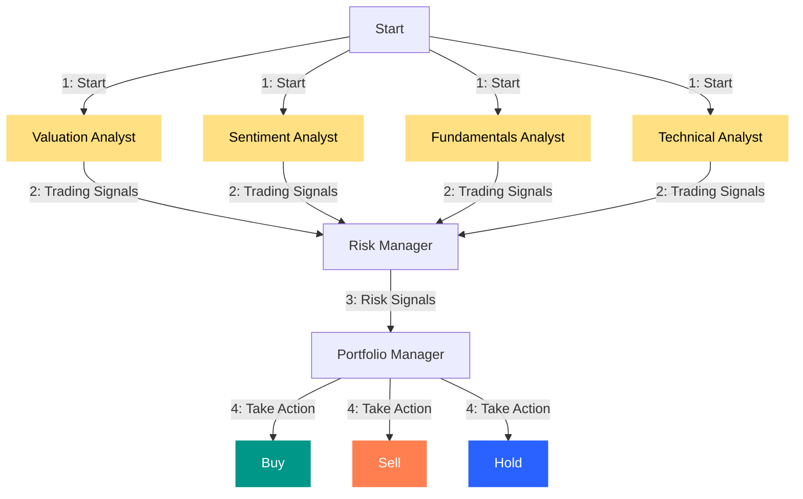

# AI Stock Analyst

This is a proof of concept for an AI-powered stock analyst, designed to explore the use of AI in making trading decisions. The primary purpose of this project is educational and it is not intended for real-world trading or investment.

The system features several agents working collaboratively:

1. **Valuation Agent** - Calculates stock intrinsic value and generates trading signals.
2. **Sentiment Agent** - Analyzes market sentiment to generate trading signals.
3. **Fundamentals Agent** - Examines fundamental data to produce trading signals.
4. **Technical Analyst** - Evaluates technical indicators for generating trading signals.
5. **Risk Manager** - Calculates risk metrics and sets position limits.
6. **Portfolio Manager** - Makes final trading decisions and generates orders.



*Note: The system simulates trading actions without executing real trades.*

## Disclaimer

This project is strictly for **educational and research purposes only**:

- Not suitable for actual trading or investment
- No warranties or guarantees provided
- Past performance does not predict future results
- Creator assumes no liability for financial losses
- Consult a financial advisor before making investment decisions

Use of this software implies agreement to use it solely for learning purposes.

## Table of Contents
- [Quick Start](#quick-start)
- [Features](#features)
- [Examples](#examples)
- [Setup](#setup)
- [Usage](#usage)
  - [Running the Hedge Fund](#running-the-hedge-fund)
  - [Running the Backtester](#running-the-backtester)
  - [Running the ML Pipeline Demo](#running-the-ml-pipeline-demo)
- [Docker](#docker)
- [LLM Providers](#llm-providers)
- [Caching](#caching)
- [Data Sources](#data-sources)
- [Architecture](#architecture)
- [Development](#development)
  - [Running Tests](#running-tests)
  - [Code Quality](#code-quality)
  - [CI/CD Pipeline](#cicd-pipeline)
- [Configuration](#configuration)
- [Project Structure](#project-structure)
- [Troubleshooting](#troubleshooting)
- [License](#license)

## Quick Start

```bash
# Clone and setup
git clone https://github.com/LiteObject/ai-stock-analyst.git
cd ai-stock-analyst
pip install -r requirements.txt
cp .env.example .env

# Add your OpenAI API key to .env
# Run analysis for AAPL (no API key needed for this ticker)
python src/main.py --ticker AAPL

# Or launch the web interface
streamlit run app/streamlit_app.py
```

## Features

- **Multi-Agent Analysis**: 6 specialized AI agents working in concert
- **Multiple LLM Support**: OpenAI, Anthropic, Google AI, Ollama
- **Free Data Sources**: Works with free tickers (AAPL, MSFT, GOOGL, NVDA, TSLA)
- **ML Pipeline**: Automated feature engineering and model training
- **Backtesting Engine**: Historical performance validation with comprehensive metrics
- **Risk Management**: Position sizing, VaR, stop-loss calculations
- **Web Interface**: Interactive Streamlit dashboard
- **Caching**: Reduce API costs during development
- **Docker Support**: Containerized deployment

## Examples

### Command Line Output

```
$ python src/main.py --ticker AAPL --show-reasoning

AI Stock Analyst - AAPL Analysis
================================

Valuation Agent:
   Signal: BUY (+0.85)
   Reasoning: Stock trading below intrinsic value

Technical Analyst:
   Signal: HOLD (+0.20)
   Reasoning: RSI neutral at 55, MACD showing consolidation

Sentiment Agent:
   Signal: BUY (+0.75)
   Reasoning: 85% analyst buy ratings, positive sentiment

Risk Manager:
   Position Size: $15,000 (15% of portfolio)
   Stop Loss: $165.00

Final Decision: BUY
   Confidence: 72%
   Order Size: 100 shares
```

### Backtesting Metrics

| Metric | Description |
|--------|-------------|
| Total Return | Overall portfolio return |
| Annualized Return | Yearly return rate |
| Sharpe Ratio | Risk-adjusted return (vs risk-free rate) |
| Sortino Ratio | Downside risk-adjusted return |
| Calmar Ratio | Return vs maximum drawdown |
| Max Drawdown | Largest peak-to-trough decline |
| Win Rate | Percentage of profitable trades |
| Profit Factor | Gross profit / Gross loss |

## Setup

Clone the repository and navigate to the project directory:

```bash
git clone https://github.com/LiteObject/ai-stock-analyst.git
cd ai-stock-analyst
```

1. Create and activate a virtual environment (recommended):

   ```bash
   python -m venv .venv
   
   # Windows
   .\.venv\Scripts\Activate.ps1
   
   # macOS/Linux
   source .venv/bin/activate
   ```

2. Install dependencies using pip:
   
   ```bash
   pip install -r requirements.txt
   ```

   Or using Make:
   ```bash
   make install
   ```

3. Set up your environment variables by copying the example configuration:

   ```bash
   cp .env.example .env
   ```

4. Update the `.env` file with your API keys:

```plaintext
# Required: Obtain Financial Datasets API key from https://financialdatasets.ai/
FINANCIAL_DATASETS_API_KEY=your-financial-datasets-api-key

# Required: OpenAI API key for portfolio management decisions
OPENAI_API_KEY=your-openai-api-key
```

**Important**: 

Financial data for AAPL, GOOGL, MSFT, NVDA, and TSLA is available at no cost and does not require an API key. For other tickers, you must set the `FINANCIAL_DATASETS_API_KEY`.

## Usage

### Running the Hedge Fund

To start the hedge fund simulation:

```bash
python src/main.py --ticker AAPL
```

You can also include a `--show-reasoning` flag to view detailed reasoning from each agent in the console.

```bash
python src/main.py --ticker AAPL --show-reasoning
```

Optionally, specify start and end dates for decision-making over a specific period:

```bash
python src/main.py --ticker AAPL --start-date 2024-01-01 --end-date 2024-03-01 
```

### Web Interface (Streamlit)

Launch the interactive web interface:

```bash
streamlit run app/streamlit_app.py
```

Or using Make:
```bash
make ui
```

The web interface provides:
- Interactive stock analysis with date range selection
- Agent selection via checkboxes
- Real-time analysis progress
- Visual trading decision display
- Detailed analyst signals with reasoning
### Running the Backtester

To backtest strategies:

```bash
python src/backtester.py --ticker AAPL
```
You can also specify start and end dates to conduct a backtest over a particular timeframe:

```bash
python src/backtester.py --ticker AAPL --start-date 2024-01-01 --end-date 2024-03-01
```

### Running the ML Pipeline Demo

To see the end-to-end Machine Learning pipeline in action (Data Ingestion -> Model Training -> Backtesting):

```bash
# Windows
$env:PYTHONPATH = "src"; python demo.py

# Linux/Mac
PYTHONPATH=src python demo.py
```

This demo:
1. Fetches historical data for SPY.
2. Trains a Random Forest Classifier to predict price direction.
3. Backtests the trained model using a confidence-based strategy.

## Docker

Run the application in a Docker container for consistent environments:

### Using Docker Compose

```bash
# Build and run the application
docker-compose up ai-stock-analyst

# Run in development mode (with source mounting)
docker-compose up dev

# Run tests
docker-compose up test
```

### Using Docker directly

```bash
# Build the image
docker build -t ai-stock-analyst .

# Run the application
docker run --env-file .env ai-stock-analyst --ticker AAPL

# Run with interactive mode
docker run -it --env-file .env ai-stock-analyst --ticker AAPL --show-reasoning
```

## LLM Providers

The application supports multiple LLM providers. Configure your preferred provider in `.env`:

### OpenAI (Default)
```env
LLM_PROVIDER=openai
OPENAI_API_KEY=your-api-key
```

### Anthropic
```bash
pip install langchain-anthropic
```
```env
LLM_PROVIDER=anthropic
ANTHROPIC_API_KEY=your-api-key
```

### Google AI
```bash
pip install langchain-google-genai
```
```env
LLM_PROVIDER=google
GOOGLE_API_KEY=your-api-key
```

### Ollama (Local)
```env
LLM_PROVIDER=ollama
OLLAMA_BASE_URL=http://localhost:11434
```

## Caching

API responses are cached to reduce costs and improve performance during development:

- **Enabled by default**: Set `CACHE_ENABLED=false` to disable
- **TTL**: Cache entries expire after 24 hours (configurable via `CACHE_TTL_HOURS`)
- **Location**: Cache files stored in `.cache/` directory

Manage the cache using Python:

```python
from tools.cache import get_cache

cache = get_cache()

# View cache statistics
print(cache.get_stats())

# Clear expired entries
cache.clear_expired()

# Clear all cache
cache.clear()
```

## Data Sources

The application integrates multiple free data sources to enhance analysis beyond the primary Financial Datasets API:

### Yahoo Finance (yfinance)
Automatically used as fallback and for extended data:

| Data Point | Description | Used By |
|------------|-------------|---------|
| Analyst Recommendations | Buy/Sell/Hold ratings from analysts | Sentiment Agent |
| Price Targets | Low, high, mean analyst price targets | Sentiment Agent |
| Institutional Holders | Top institutional shareholders | Sentiment Agent |
| Options Data | Put/call ratios, implied volatility | Sentiment Agent |
| Earnings History | Historical EPS actual vs estimates | Fundamentals Agent |
| ESG Scores | Environmental, Social, Governance ratings | Extended Analysis |

### Fear & Greed Index (CNN Money)
Market-wide sentiment indicator:

| Score Range | Classification | Interpretation |
|-------------|----------------|----------------|
| 0-25 | Extreme Fear | Contrarian bullish signal |
| 25-45 | Fear | Cautious sentiment |
| 45-55 | Neutral | Balanced market |
| 55-75 | Greed | Optimistic sentiment |
| 75-100 | Extreme Greed | Contrarian bearish signal |

### FRED (Federal Reserve Economic Data)
Economic indicators (requires free API key):

| Indicator | Series ID | Description |
|-----------|-----------|-------------|
| Fed Funds Rate | DFF | Current interest rate |
| 10-Year Treasury | DGS10 | Long-term bond yield |
| 2-Year Treasury | DGS2 | Short-term bond yield |
| Yield Curve | DGS10-DGS2 | Recession indicator |
| CPI | CPIAUCSL | Inflation measure |
| Unemployment | UNRATE | Labor market health |

Get your free FRED API key at: https://fred.stlouisfed.org/docs/api/api_key.html

### SEC EDGAR
Free access to company filings:
- 10-K (Annual reports)
- 10-Q (Quarterly reports)
- 8-K (Current reports)

### Using Extended Data

```python
from tools.free_data_sources import (
    get_extended_stock_data,
    get_market_sentiment,
    get_analyst_price_targets,
    get_options_data,
    get_fear_greed_index,
)

# Get all available extended data for a stock
data = get_extended_stock_data("AAPL")

# Get market-wide sentiment indicators
sentiment = get_market_sentiment()

# Individual data points
targets = get_analyst_price_targets("AAPL")
options = get_options_data("AAPL")
fear_greed = get_fear_greed_index()
```

## Architecture

### System Design

- **Multi-Agent System**: Specialized agents for different analysis types
- **Event-Driven**: Agents communicate through an event system
- **Modular Data Layer**: Pluggable data providers with fallback support
- **ML Pipeline**: Feature engineering -> Model training -> Backtesting
- **Risk Management**: Position sizing, stop-loss, and portfolio limits

### Technology Stack

| Category | Technologies |
|----------|--------------|
| Core | Python 3.10+, LangChain, Pydantic |
| ML | scikit-learn, XGBoost, pandas, numpy |
| Data | yfinance, FRED API, SEC EDGAR |
| UI | Streamlit |
| Database | SQLAlchemy, SQLite |
| Testing | pytest, pytest-cov |

## Development

### Running Tests

The project includes a comprehensive test suite. Run all tests with:

```bash
python -m pytest tests/ -v
```

Or using Make:
```bash
make test
```

Run tests with coverage report:
```bash
make test-cov
```

### Code Quality

Format code with Black and isort:
```bash
make format
```

Run linting checks:
```bash
make lint
```

### CI/CD Pipeline

The project uses GitHub Actions for continuous integration:

- **Testing**: Runs on Python 3.10, 3.11, and 3.12
- **Linting**: Black, isort, flake8, and mypy
- **Security**: Bandit and Safety scans

The pipeline runs automatically on push and pull requests to the main branch.

## Configuration

The application can be configured via environment variables in your `.env` file:

### Required

| Variable | Description |
|----------|-------------|
| `FINANCIAL_DATASETS_API_KEY` | API key for financial data (free for some tickers) |
| `OPENAI_API_KEY` | OpenAI API key (or configure alternative LLM provider) |

### Optional Free Data Sources

| Variable | Description | Default |
|----------|-------------|---------|
| `FRED_API_KEY` | FRED API key for economic data (free) | - |

### LLM Configuration

| Variable | Description | Default |
|----------|-------------|---------|
| `LLM_PROVIDER` | LLM provider (openai, anthropic, ollama, google) | `openai` |
| `DEFAULT_MODEL` | LLM model to use | `gpt-4o` |
| `MODEL_TEMPERATURE` | Temperature for LLM responses | `0.0` |
| `ANTHROPIC_API_KEY` | Anthropic API key (if using Anthropic) | - |
| `GOOGLE_API_KEY` | Google AI API key (if using Google) | - |
| `OLLAMA_BASE_URL` | Ollama server URL (if using Ollama) | `http://localhost:11434` |

### Caching Configuration

| Variable | Description | Default |
|----------|-------------|---------|
| `CACHE_ENABLED` | Enable/disable API response caching | `true` |
| `CACHE_TTL_HOURS` | Cache time-to-live in hours | `24` |

### Trading Configuration

| Variable | Description | Default |
|----------|-------------|---------|
| `DEFAULT_INITIAL_CAPITAL` | Starting capital for trading | `100000.0` |
| `MAX_POSITION_PERCENTAGE` | Max position size (% of portfolio) | `0.20` |
| `LIQUIDITY_LIMIT_PERCENTAGE` | Max % of daily volume to trade | `0.10` |

### Other Settings

| Variable | Description | Default |
|----------|-------------|---------|
| `API_TIMEOUT_SECONDS` | Timeout for API requests | `30` |
| `MAX_RETRIES` | Maximum retries for API requests | `3` |
| `LOG_LEVEL` | Logging level | `INFO` |

See `.env.example` for a complete template.

## Project Structure 

```
ai-stock-analyst/
├── .github/
│   └── workflows/
│       └── ci.yml                # GitHub Actions CI/CD pipeline
├── app/                          # Streamlit web interface
│   ├── __init__.py
│   ├── components.py             # Reusable UI components
│   └── streamlit_app.py          # Main Streamlit application
├── src/
│   ├── agents/                   # Agent definitions and workflow
│   │   ├── fundamentals.py       # Fundamental analysis agent
│   │   ├── hedge_fund_manager.py # Sophisticated hedge fund manager
│   │   ├── portfolio_manager.py  # Portfolio management agent
│   │   ├── risk_manager.py       # Risk management agent
│   │   ├── sentiment.py          # Sentiment analysis agent (multi-source)
│   │   ├── technicals.py         # Technical analysis agent
│   │   └── valuation.py          # Valuation analysis agent
│   ├── backtesting/              # Backtesting framework
│   │   ├── engine.py             # Core backtesting engine
│   │   ├── metrics.py            # Performance metrics calculation
│   │   ├── strategy.py           # Strategy base class
│   │   └── walk_forward.py       # Walk-forward analysis
│   ├── core/                     # Core domain models
│   │   ├── events.py             # Event system
│   │   ├── exceptions.py         # Custom exceptions
│   │   ├── interfaces.py         # Abstract interfaces
│   │   └── models.py             # Pydantic data models
│   ├── data/                     # Data ingestion layer
│   │   └── providers/            # Data provider implementations
│   │       ├── base.py           # Base provider interface
│   │       ├── massive.py        # Massive data provider
│   │       └── yahoo.py          # Yahoo Finance provider
│   ├── database/                 # Database layer
│   │   ├── connection.py         # Database connection management
│   │   ├── models.py             # SQLAlchemy models
│   │   └── repositories.py       # Data access repositories
│   ├── graph/                    # State management
│   │   └── state.py              # Agent state definitions
│   ├── ml/                       # Machine learning pipeline
│   │   ├── features/             # Feature engineering
│   │   │   ├── fundamental.py    # Fundamental features
│   │   │   ├── sentiment.py      # Sentiment features
│   │   │   └── technical.py      # Technical indicators
│   │   ├── models/               # ML models
│   │   │   ├── base.py           # Base model interface
│   │   │   └── ensemble.py       # Ensemble predictor (RF, XGBoost)
│   │   └── training/             # Model training
│   │       └── trainer.py        # Model trainer
│   ├── risk/                     # Risk management
│   │   ├── limits.py             # Trading limits
│   │   ├── portfolio.py          # Portfolio risk analysis
│   │   ├── position_sizing.py    # Position sizing algorithms
│   │   └── var.py                # Value at Risk calculations
│   ├── tools/                    # Modular data tools
│   │   ├── __init__.py           # Package exports
│   │   ├── api.py                # Primary API (backward compat)
│   │   ├── api_client.py         # Core HTTP client utilities
│   │   ├── cache.py              # Disk-based caching layer
│   │   ├── data_sources.py       # Data source registry
│   │   ├── economic_tools.py     # FRED data & yield curve
│   │   ├── free_data_sources.py  # Extended free sources (compat)
│   │   ├── fundamental_tools.py  # Financial metrics & line items
│   │   ├── holdings_tools.py     # Institutional holders
│   │   ├── market_data_tools.py  # Options, earnings, ESG
│   │   ├── price_tools.py        # OHLCV price data
│   │   ├── sec_tools.py          # SEC EDGAR filings
│   │   ├── sentiment_tools.py    # Analyst & Fear/Greed
│   │   └── web_search.py         # Web search (Tavily/DuckDuckGo)
│   ├── utils/                    # Utility functions
│   │   └── display.py            # Display formatting utilities
│   ├── backtester.py             # CLI backtesting entry point
│   ├── config.py                 # Configuration management
│   ├── llm.py                    # LLM provider abstraction
│   └── main.py                   # Main entry point
├── tests/                        # Test suite
│   ├── conftest.py               # Pytest fixtures
│   ├── test_agents.py            # Agent unit tests
│   ├── test_api.py               # API unit tests
│   ├── test_backtesting.py       # Backtesting tests
│   └── test_ml.py                # ML pipeline tests
├── images/                       # Documentation images
├── .dockerignore                 # Docker ignore patterns
├── .env.example                  # Example environment configuration
├── demo.py                       # ML pipeline demonstration script
├── docker-compose.yml            # Docker Compose configuration
├── Dockerfile                    # Container definition
├── Makefile                      # Development commands
├── requirements.txt              # Python dependencies
└── README.md
```

## Troubleshooting

### Common Issues

**ImportError: No module named 'langchain'**
```bash
pip install -r requirements.txt
```

**API Rate Limiting**
- Enable caching: `CACHE_ENABLED=true` in `.env`
- Reduce request frequency

**No data returned for ticker**
- Check if ticker requires `FINANCIAL_DATASETS_API_KEY`
- Free tickers: AAPL, GOOGL, MSFT, NVDA, TSLA

**LLM Provider Errors**
- Verify your API key is correctly set in `.env`
- Check API usage limits on your provider's dashboard
- Try switching to a different LLM provider

**Streamlit App Not Loading**
```bash
# Ensure you're in the project root directory
streamlit run app/streamlit_app.py --server.port 8501
```
