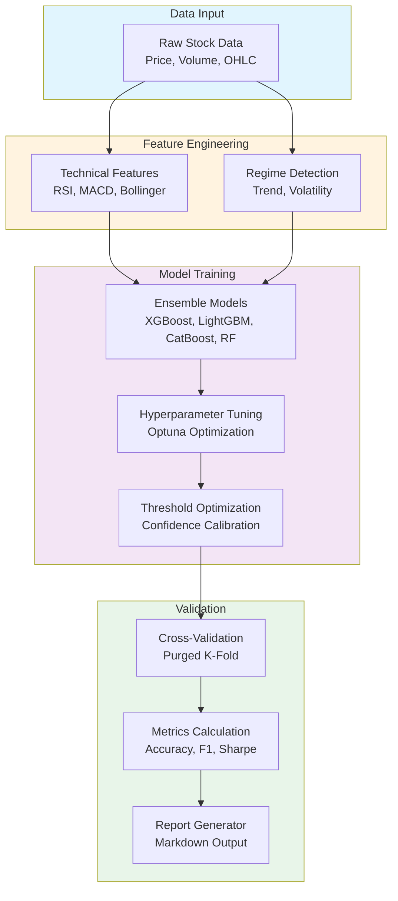

# ML Module Guide

A simple explanation of how the Machine Learning module works in AI Stock Analyst.

## Overview

Think of the ML module as a **stock prediction factory** with 5 main departments:

---

## Prerequisites

Before running the ML validator, ensure you have:

- **Python 3.10+** installed
- **Required packages**: `pip install -r requirements.txt`
- **Minimum data**: At least 6 months of historical data for meaningful results
- **Memory**: At least 8GB RAM (16GB recommended for multiple tickers)
- **(Optional)** NVIDIA GPU with CUDA 11.0+ support for faster training (e.g., RTX 3090, 4090)

---

## 1. Feature Engineering (`ml/features/`)

*"Turning raw stock data into useful signals"*

This is like a **research department** that takes raw stock prices and transforms them into meaningful indicators that help predict future movements.

| Module | What It Does | Simple Analogy |
|--------|--------------|----------------|
| **`technical.py`** | Calculates RSI, MACD, Bollinger Bands, etc. | Like a doctor checking vital signs (pulse, blood pressure) |
| **`advanced.py`** | Creates sophisticated features like volatility measures, volume patterns | Like running advanced medical tests (MRI, blood work) |
| **`regime.py`** | Detects market conditions (bullish, bearish, volatile) | Like checking the weather before going outside |
| **`cross_asset.py`** | Compares stocks to each other and the market | Like comparing a student's grades to the class average |

### Example Flow

```
Raw Data (price, volume) 
    → Technical Features (RSI=65, MACD=positive)
    → Regime Features (trend=bullish, volatility=low)
    → Final Feature Set (50+ columns of useful signals)
```

---

## 2. Models (`ml/models/`)

*"The prediction engines"*

This is like having **multiple expert advisors** who each give their opinion, then you combine them.

| Module | What It Does | Simple Analogy |
|--------|--------------|----------------|
| **`ensemble.py`** | Combines XGBoost, LightGBM, CatBoost, Random Forest | Like asking 4 doctors for their diagnosis, then taking a vote |
| **`meta_learner.py`** | Learns how to best combine the individual models | Like a senior doctor who knows which specialist to trust more |

### How Ensemble Works

```
Input Features
    ↓
┌─────────────┬─────────────┬─────────────┬─────────────┐
│   XGBoost   │  LightGBM   │  CatBoost   │Random Forest│
│   "Buy 70%" │  "Buy 65%"  │  "Buy 75%"  │  "Buy 60%"  │
└─────────────┴─────────────┴─────────────┴─────────────┘
    ↓
Weighted Average (based on past accuracy)
    ↓
Final Prediction: "Buy with 68% confidence"
```

---

## 3. Tuning (`ml/tuning/`)

*"Finding the best settings"*

This is like **adjusting the knobs on a radio** to get the clearest signal.

| Module | What It Does | Simple Analogy |
|--------|--------------|----------------|
| **`hyperparameter.py`** | Finds optimal model settings using Optuna | Like a chef experimenting with ingredient amounts to find the perfect recipe |
| **`threshold.py`** | Decides when to act on predictions | Like deciding "I'll only buy if the model is at least 60% confident" |

>Hyperparameters are settings like:
>- Max depth of decision trees
>- Learning rate
>- Number of estimator

### Hyperparameter Tuning Example

```
Trial 1: max_depth=3, learning_rate=0.1  → Accuracy: 52%
Trial 2: max_depth=5, learning_rate=0.05 → Accuracy: 55%
Trial 3: max_depth=7, learning_rate=0.01 → Accuracy: 58%  ← Best!
...
Trial 50: Final best settings found
```

---

## 4. Validation (`ml/validation/`)

*"Testing if our predictions actually work"*

This is like **grading a student's work** - but being very careful not to cheat.

| Module | What It Does | Simple Analogy |
|--------|--------------|----------------|
| **`cross_validation.py`** | Tests model on different time periods | Like testing a student with multiple exams, not just one |
| **`validation_metrics.py`** | Calculates accuracy, F1 score, directional accuracy | Like grading exams with different scoring methods |
| **`reporter.py`** | Creates summary reports | Like generating a report card |

### Why Special Cross-Validation for Finance

```
❌ Wrong Way (Data Leakage):
   Train: [Jan, Mar, May, Jul]  Test: [Feb, Apr, Jun, Aug]
   Problem: You're using future data to predict the past!

✅ Right Way (Purged K-Fold):
   Train: [Jan-Jun]  Gap: [Jul]  Test: [Aug-Dec]
   The "gap" prevents information from leaking
```

### Choosing the Right Cross-Validation Strategy

| Strategy | When to Use | Pros | Cons |
|----------|-------------|------|------|
| **purged_kfold** | Default choice for most cases | Prevents look-ahead bias, uses all data | Slightly complex setup |
| **time_series** | Strong temporal patterns expected | Strictly respects time order | May not use all data efficiently |

**Recommendation**: Start with `purged_kfold` unless you have a specific reason to use time series CV.

---

## 5. CLI Validator (`src/cli/ml_validator.py`)

*"The control panel that runs everything"*

This ties everything together into a simple command-line tool.

### What It Does Step by Step

```
Step 1: Load Data
   └── Get stock prices for AAPL, MSFT, GOOGL, etc.

Step 2: Engineer Features
   └── Calculate 50+ technical indicators and signals

Step 3: Prepare Labels
   └── Create "target" = 1 if stock goes up in 5 days, 0 otherwise

Step 4: Cross-Validation
   └── Test the model on 5 different time periods

Step 5: Hyperparameter Optimization (optional)
   └── Find the best model settings

Step 6: Calculate Metrics
   └── Accuracy, F1 Score, Directional Accuracy

Step 7: Generate Report
   └── Save results to a markdown file
```

---

## Visual Summary



---

## Key Concepts in Plain English

| Concept | What It Means |
|---------|---------------|
| **Feature** | A piece of information the model uses to make predictions (like RSI or moving average) |
| **Label/Target** | What we're trying to predict (will stock go up or down?) |
| **Ensemble** | Combining multiple models to get better predictions |
| **Hyperparameter** | Settings you choose before training (like how deep a decision tree can grow) |
| **Cross-Validation** | Testing the model multiple times on different data splits |
| **Purged CV** | Special cross-validation that prevents "cheating" by looking at future data |
| **Threshold** | The confidence level needed before acting on a prediction |
| **GPU Acceleration** | Using your graphics card (e.g., RTX 4090) to train models much faster |

---

## Understanding the Metrics

After running the validator, here's how to interpret the results:

| Metric | Target Range | What It Means |
|--------|--------------|---------------|
| **Accuracy** | > 0.52 | Better than random guessing (50%) |
| **F1 Score** | > 0.50 | Good balance between precision and recall |
| **Precision** | > 0.55 | When we predict "buy", how often are we right? |
| **Recall** | > 0.50 | Of all actual "buy" opportunities, how many did we catch? |
| **Directional Accuracy** | > 0.52 | Did we predict the price direction correctly? |

### Red Flags

- **Accuracy > 0.70**: Likely overfitting - the model memorized the training data
- **High variance between folds**: Unstable model, results depend too much on data split
- **F1 much lower than Accuracy**: Class imbalance issue - model might be predicting mostly one class

### Green Flags

- **Consistent metrics across folds**: Stable, reliable model
- **Accuracy between 0.52-0.60**: Realistic edge for financial predictions
- **Low standard deviation (± < 0.03)**: Robust performance

---

## How to Use It

### Basic Run

```bash
# Set Python path and run
$env:PYTHONPATH = "src"
python -m cli.ml_validator --tickers AAPL MSFT GOOGL
```

### Full Validation with GPU

```bash
python -m cli.ml_validator \
    --tickers AAPL MSFT GOOGL NVDA TSLA SPY \
    --start 2020-01-01 \
    --end 2025-01-01 \
    --use-gpu
```

### With Hyperparameter Optimization

```bash
python -m cli.ml_validator \
    --tickers AAPL \
    --optimize \
    --n-trials 100
```

### Available Options

| Option | Description | Default |
|--------|-------------|---------|
| `--tickers` | Stock symbols to analyze | AAPL MSFT GOOGL NVDA TSLA SPY |
| `--start` | Start date | 2020-01-01 |
| `--end` | End date | 2025-01-01 |
| `--use-gpu` | Enable GPU acceleration | True |
| `--cv-strategy` | Cross-validation method | purged_kfold |
| `--n-splits` | Number of CV folds | 5 |
| `--optimize` | Run hyperparameter tuning | False |
| `--n-trials` | Number of Optuna trials | 50 |
| `--output` | Report output path | Auto-generated |
| `--verbose` | Enable debug logging | False |

---

## Output

The tool generates a markdown report showing:

- **Configuration**: Tickers, date range, CV strategy
- **Cross-Validation Results**: Mean accuracy and F1 score across folds
- **Validation Metrics**: Accuracy, F1, precision, recall
- **GPU Information**: Whether GPU acceleration was used

Example output:

```
============================================================
AI Stock Analyst - ML Validation Pipeline
============================================================

Configuration:
  Tickers: AAPL, MSFT, GOOGL
  Date Range: 2020-01-01 to 2025-01-01
  GPU Enabled: True
  CV Strategy: purged_kfold
  N Splits: 5

2025-11-28 - Running cross-validation with purged_kfold (5 splits)...
  Fold 1: Accuracy=0.5423, F1=0.5512
  Fold 2: Accuracy=0.5389, F1=0.5401
  ...
  Mean accuracy: 0.5402 ± 0.0145

============================================================
Validation Complete!
============================================================

Report saved to: validation_report_20251128_143022.md

Key Metrics:
  Accuracy: 0.5402
  F1 Score: 0.5456
```

---

## File Structure

```
src/ml/
├── __init__.py
├── features/
│   ├── __init__.py
│   ├── technical.py      # RSI, MACD, Bollinger Bands
│   ├── advanced.py       # Volatility, microstructure
│   ├── regime.py         # Market regime detection
│   └── cross_asset.py    # Cross-asset correlations
├── models/
│   ├── base.py           # Base model interface
│   ├── ensemble.py       # XGBoost, LightGBM, RF
│   └── meta_learner.py   # Stacking ensemble
├── tuning/
│   ├── __init__.py
│   ├── hyperparameter.py # Optuna optimization
│   └── threshold.py      # Threshold optimization
├── validation/
│   ├── __init__.py
│   ├── cross_validation.py  # Purged K-Fold, Time Series CV
│   ├── validation_metrics.py # Accuracy, F1, directional
│   └── reporter.py          # Report generation
└── training/
    └── trainer.py        # Model training utilities
```

---

## Troubleshooting

### GPU Not Detected

```bash
# Check if CUDA is available
python -c "import torch; print('CUDA available:', torch.cuda.is_available())"

# Check GPU name
python -c "import torch; print(torch.cuda.get_device_name(0) if torch.cuda.is_available() else 'No GPU')"
```

**Solutions**:
- Ensure NVIDIA drivers are installed
- Install PyTorch with CUDA: `pip install torch --index-url https://download.pytorch.org/whl/cu118`

### Out of Memory Error

```
RuntimeError: CUDA out of memory
```

**Solutions**:
- Reduce `--n-trials` for hyperparameter optimization (try 20 instead of 100)
- Use fewer tickers in a single run
- Add `--no-gpu` flag to use CPU instead
- Close other GPU-intensive applications

### Slow Data Loading

**Solutions**:
- Check your internet connection (data is fetched from Yahoo Finance)
- Use a shorter date range for testing
- The first run is slower; subsequent runs use cached data

### Import Errors

```
ModuleNotFoundError: No module named 'ml'
```

**Solution**: Set the Python path before running:

```bash
# Windows PowerShell
$env:PYTHONPATH = "src"

# Linux/Mac
export PYTHONPATH=src
```

### Low Accuracy Results

If accuracy is around 50% (random guessing):

1. **Check data quality**: Ensure you have enough historical data
2. **Try different features**: Some features work better for certain stocks
3. **Adjust prediction horizon**: Try `--prediction-horizon 1` or `10` instead of default 5
4. **Market conditions**: Some periods are harder to predict than others

---

## Quick Reference

| Task | Command |
|------|--------|
| Quick test (single stock) | `python -m cli.ml_validator --tickers AAPL` |
| Multiple stocks | `python -m cli.ml_validator --tickers AAPL MSFT GOOGL` |
| Custom date range | `python -m cli.ml_validator --start 2022-01-01 --end 2024-12-31` |
| With optimization | `python -m cli.ml_validator --tickers AAPL --optimize --n-trials 50` |
| Time series CV | `python -m cli.ml_validator --cv-strategy time_series` |
| More CV folds | `python -m cli.ml_validator --n-splits 10` |
| Debug mode | `python -m cli.ml_validator --verbose` |
| Save to specific file | `python -m cli.ml_validator --output my_report.md` |

---

## Next Steps

After validating your model:

1. **Review the report**: Check for red flags mentioned above
2. **Iterate on features**: Try enabling/disabling different feature groups
3. **Tune hyperparameters**: Use `--optimize` for better results
4. **Backtest**: Use the trained model with `src/backtester.py`
5. **Integrate**: Use predictions in the main agent system for trading decisions
